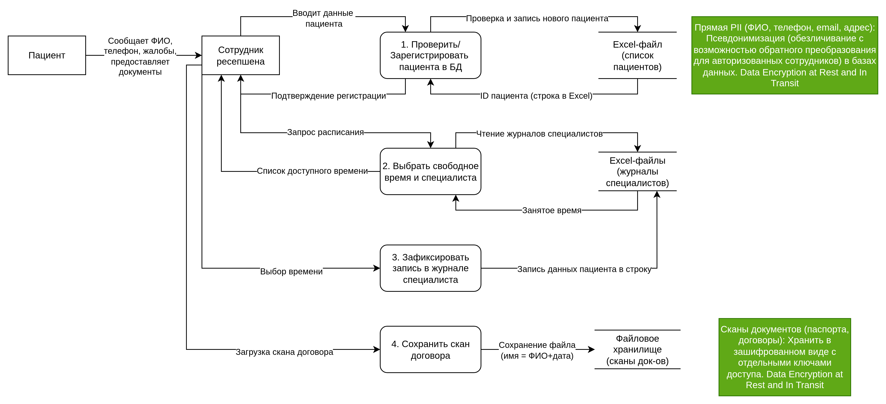
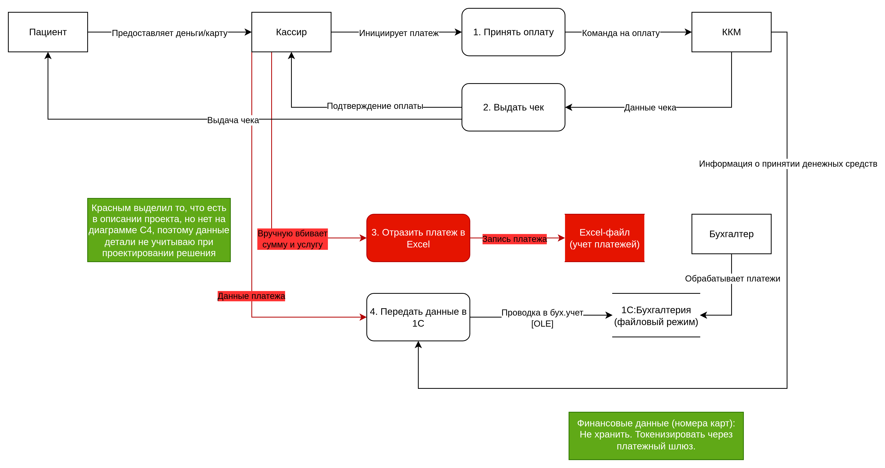
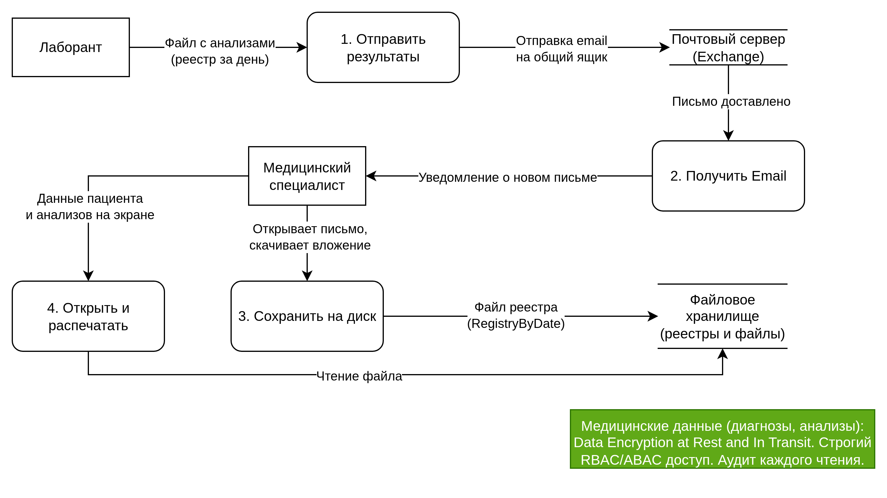

# Задание 1. Анализ безопасности системы

## Диаграммы потоков данных (Data Flow Diagrams)

### Процесс 1: Запись пациента на прием (через ресепшен)

[DFD записи пациента на прием (через ресепшен)](./DFDs/Process1.drawio)

### Процесс 2: Оплата медицинских услуг

[DFD оплаты медицинских услуг](./DFDs/Process2.drawio)

### Процесс 3: Получение результатов анализов из лаборатории

[DFD получения результатов анализов из лаборатории](./DFDs/Process3.drawio)

## Cписок проблемных зон

1. Данные не структурированы и не классифицированы.
2. Полное отсутствие контроля доступа (RBAC/ABAC) к медицинским и PII данным.
3. Нет аудита действий пользователей с конфиденциальной информацией.
4. Избыточность и дублирование данных при ручном вводе.
5. Данные передаются и хранятся в открытом виде (без шифрования).
6. Несоответствие требованиям законодательства РФ (152-ФЗ) по защите ПДн.
7. Отсутствие механизмов для безопасного обмена данными с партнерами (лаборатория).

## Рекомендации по улучшению (на основе анализа As-Is)

Так как детальное проектирование новой платформы, выбор конкретных технологий и разработка интеграций будут выполняться в рамках следующих заданий. На данном этапе, на основе анализа текущих DFD были сформулированы общие требования и направления для улучшения безопасности данных.

Для решения выявленных проблем предлагается внедрить следующие механизмы и инструменты, которые должны быть отражены на целевых DFD.

**Список данных и способы их защиты**:

- Прямая PII (ФИО, телефон, email, адрес): Псевдонимизация (обезличивание с возможностью обратного преобразования для авторизованных сотрудников) в базах данных. Шифрование при хранении (encryption at rest).
- Медицинские данные (диагнозы, анализы): Шифрование при хранении. Строгий RBAC/ABAC доступ. Аудит каждого чтения.
- Финансовые данные (номера карт): Не хранить. Токенизировать через платежный шлюз.
- Сканы документов (паспорта, договоры): Хранить в зашифрованном виде с отдельными ключами доступа. Индексировать метаданные, но не ПИИ-данные в названии файла.

**Механизм тегирования данных (Data Tagging)**:
Внедрить политику, при которой при создании/загрузке любого документа или записи в систему, она автоматически или вручную помечается тегом, определяющим уровень критичности. Например:

- `PII_Public`: Имя, город.
- `PII_Sensitive`: Телефон, email, адрес.
- `PII_Medical`: Диагнозы, анализы.
- `PII_Financial`: Платежная информация.

Эти теги будут использоваться системами безопасности для применения политик (шифрование, маскирование, запрет на выгрузку и т.д.).

**Список инструментов и мер**:

- Vault (например, HashiCorp Vault): Для централизованного хранения секретов (ключей шифрования, паролей к БД) и управления доступом к ним.
- API Gateway: Для всех новых сервисов (портал клиента, CRM). Будет проверять аутентификацию, авторизацию (по тегам данных), и обеспечивать безопасную передачу данных (mTLS).
- Data Masking/Tokenization Service: Сервис, который будет обезличивать данные на лету для неавторизованных пользователей или при передаче в аналитические системы (BI, ML).
- SIEM System (Security Information and Event Management): Система типа Splunk, ELK Stack или Victoria Metrics (уже есть в стеке) для сбора логов доступа ко всем данным и настройки алертов на подозрительные действия.
- Database Encryption: Использование прозрачного шифрования данных (TDE) в Postgres и ClickHouse.
- Data Lineage Tools: Инструменты для отслеживания происхождения данных, особенно для ML-задач, чтобы знать, откуда пришла конкретная информация.