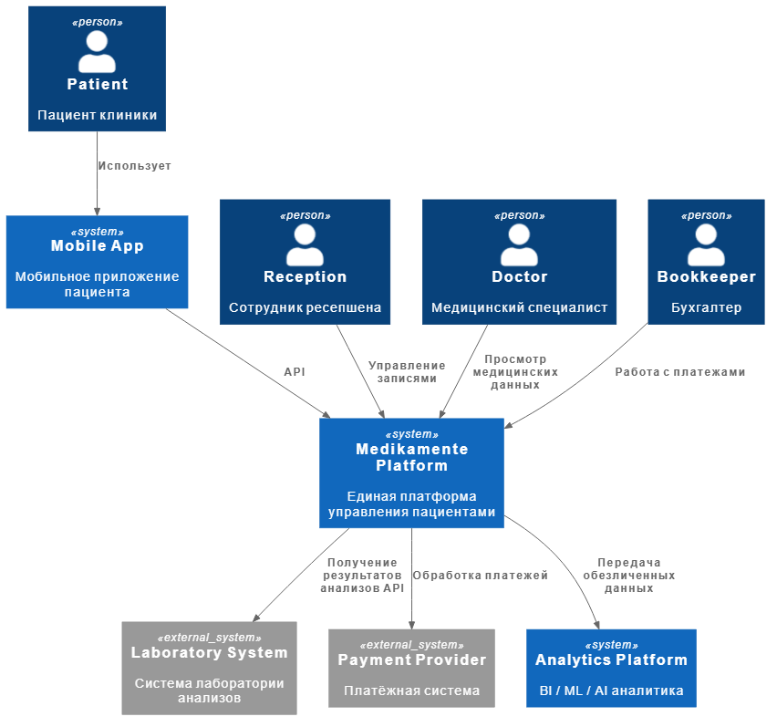

# Задание 2. Проектирование решения

## 1. Новые архитектурные блоки системы

Для реализации Privacy by Design предлагается добавить следующие архитектурные компоненты.

### Identity and Access Management (IAM)

Назначение:
- централизованная аутентификация
- авторизация пользователей
- управление ролями

Функции:
- OAuth2 / OpenID Connect
- RBAC / ABAC
- SSO для сотрудников
- MFA

Пример технологий:
- Keycloak
- Auth0
- Azure AD

### API Gateway

Назначение:
- единая точка входа в систему

Функции:
- авторизация
- rate limiting
- audit
- masking данных
- защита API

### Consent Management Service

Назначение:
- управление согласиями пациентов на обработку персональных данных

Функции:
- хранение согласий
- отзыв согласия
- управление сроками хранения данных
- соответствие требованиям законодательства РФ

### Data Classification Service

Назначение:
- классификация данных по уровню конфиденциальности

Примеры классов:
- Public
- Internal
- Personal Data
- Medical Data (Sensitive)

### Data Tagging System

Назначение:
- маркировка данных

Примеры тегов:
- PII
- MEDICAL
- FINANCIAL
- CONFIDENTIAL

Эти теги используются:
- системой доступа
- системой мониторинга
- системой аудита

### Audit/Monitoring System

Назначение:
- контроль доступа к данным

Функции:
- аудит доступа
- обнаружение аномалий
- уведомления о подозрительной активности

Технологии:
- ELK Stack
- SIEM
- Victoria Metrics

### Secure Data Storage

Назначение:
- безопасное хранение данных

Требования:
- шифрование
- разделение данных
- контроль доступа

Технологии:
- PostgreSQL
- encrypted storage
- secret management

## 2. Слой аналитики данных (Privacy by Design)

Компания планирует использовать данные для:
- BI
- ML
- AI
- LLM

Поэтому вводится Analytics Layer.

Архитектура аналитики:

```
Operational Systems
        ↓
Data Ingestion Layer
        ↓
Data Classification
        ↓
Data Anonymization
        ↓
Data Lake
        ↓
Analytics / ML / BI
```

### Data Ingestion Layer

Импорт данных из:
- CRM
- портала
- лаборатории
- платежных систем

### Data Anonymization Layer

Перед попаданием в аналитическое хранилище данные:
- обезличиваются
- псевдонимизируются
- агрегируются

### Data Lake

Используется для:
- хранения исторических данных
- аналитики
- ML

Технологии:
- ClickHouse
- S3
- Spark

### Analytics / ML Platform

Используется для:
- BI
- отчётов
- ML моделей

Технологии:
- Python
- Jupyter
- Spark
- ML pipelines

## 3. Диаграмма контекста

[Диаграмма контекста](./C4_Context.puml)

<div align="center">



</div>