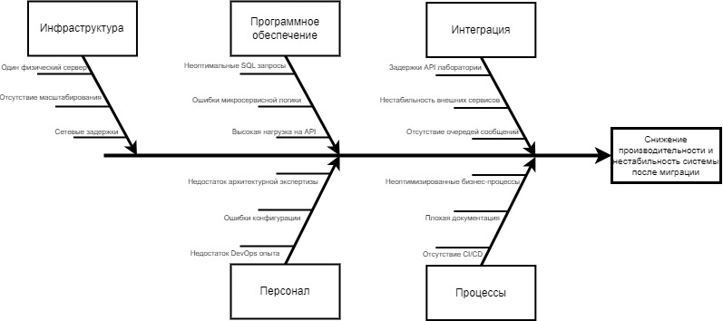

# Задание 4. Оценка узких мест при миграции

## 1. Анализ текущей системы

Текущая архитектура системы компании Medikamente имеет ряд ограничений

### Основные характеристики системы

- хранение данных в Excel-файлах
- использование 1C в файловом режиме
- единый физический сервер
- отсутствие централизованного управления данными
- отсутствие контроля потоков данных
- отсутствие аудита доступа

### Цель миграции

Компания планирует:
- перейти к современной архитектуре (микросервисы)
- внедрить портал пациентов
- реализовать интеграции через API
- внедрить аналитическую платформу

## 2. Ключевые компоненты, затрагиваемые миграцией

Миграция затронет следующие элементы системы

### Инфраструктура

- сервер
- сеть
- системы хранения

### Базы данных

- Excel
- файловые базы 1С
- будущая PostgreSQL

### Интеграции

- лаборатория
- платёжные системы
- внутренние сервисы

### Бизнес-логика

- запись пациентов
- обработка платежей
- ведение медицинских карт

## 3. Диаграмма Исикавы (Fishbone Diagram)

Цель анализа:
- выявить причины возможных узких мест и снижения производительности системы после миграции

Основные категории:
- Инфраструктура
- Программное обеспечение
- Интеграция
- Персонал
- Процессы

[Диаграмма Исикавы](./ishikawa.xml)

## 4. Основные выявленные проблемы

| Категория               | Проблема                      | Возможные последствия |
| ----------------------- | ----------------------------- | --------------------- |
| Инфраструктура          | один физический сервер        | отказ системы         |
| Инфраструктура          | отсутствие масштабируемости   | рост нагрузки         |
| Программное обеспечение | неэффективная архитектура     | медленные сервисы     |
| Программное обеспечение | неоптимальные SQL запросы     | перегрузка БД         |
| Интеграция              | нестабильные API              | ошибки данных         |
| Интеграция              | задержки интеграций           | ухудшение UX          |
| Персонал                | нехватка DevOps навыков       | ошибки развертывания  |
| Персонал                | нехватка архитектурного опыта | ошибки проектирования |
| Процессы                | отсутствие CI/CD              | медленные релизы      |
| Процессы                | плохая документация           | ошибки поддержки      |

## 5. Рекомендации по устранению узких мест

### Инфраструктура

Рекомендации:
- переход к облачной инфраструктуре
- использование Kubernetes
- внедрение автоматического масштабирования

### Базы данных

Рекомендации:
- миграция с Excel на PostgreSQL
- внедрение репликации
- оптимизация SQL

### Интеграции

Рекомендации:
- использовать API Gateway
- использовать message broker

Примеры:
- Kafka
- RabbitMQ

### DevOps

Рекомендации:
- внедрение CI/CD
- инфраструктура как код

Инструменты:
- GitLab CI
- Terraform
- Helm

### Мониторинг

Рекомендации:
- мониторинг системы
- мониторинг производительности

Инструменты:
- Prometheus
- Victoria Metrics
- Grafana

## 6. Приоритетность мер

| Приоритет | Мера                           | Причина                  |
| --------- | ------------------------------ | ------------------------ |
| Высокий   | переход на централизованную БД | устранение Excel         |
| Высокий   | внедрение CI/CD                | ускорение релизов        |
| Высокий   | мониторинг системы             | обнаружение проблем      |
| Средний   | внедрение API Gateway          | контроль интеграций      |
| Средний   | внедрение Kubernetes           | масштабируемость         |
| Низкий    | оптимизация бизнес процессов   | долгосрочная оптимизация |