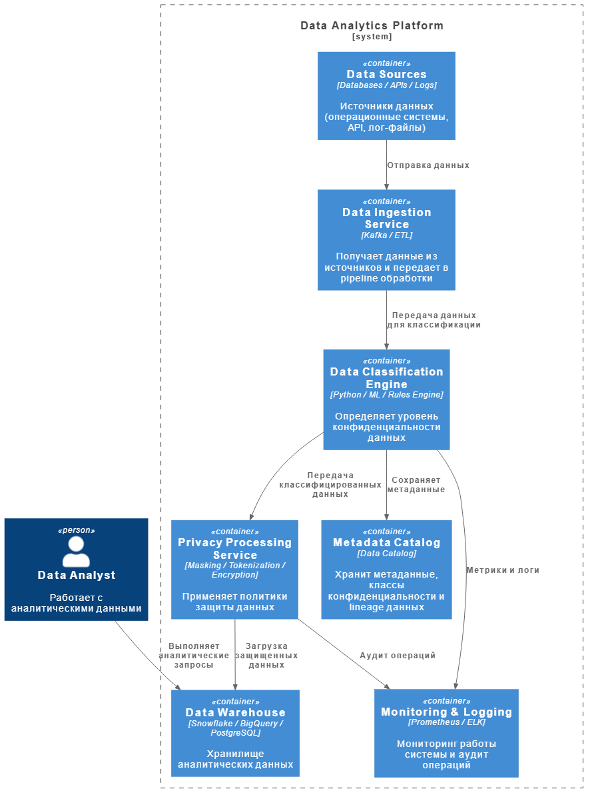

# Задание 6. Классификация данных

## 1. Архитектура движка классификации данных

Для обеспечения принципов Privacy by Design перед загрузкой данных в аналитическое хранилище добавляется слой классификации данных (Data Classification Layer).

Этот слой анализирует входящие данные, определяет уровень конфиденциальности и применяет соответствующие правила обработки.

Основная проблема - данные могут менять структуру и быть не размечены, поэтому используется комбинация правил + ML-классификации + метаданных.

### Диаграмма C2 движка, реализующего задачу классификации данных перед загрузкой их в хранилище

[Диаграмма C2](./C4_Container.puml)

## 2. Логическая архитектура решения

Основные компоненты

### Data Ingestion Layer

Слой загрузки данных из источников

Источники:
- операционные БД
- API
- лог-файлы
- внешние сервисы

Инструменты:
- Kafka / RabbitMQ
- ETL/ELT pipelines (Airflow)

Функции:
- сбор данных
- первичная валидация
- передача в классификационный движок

### Data Classification Engine

Ключевой компонент решения

Функции:
- анализ структуры данных
- выявление персональных данных
- определение уровня конфиденциальности
- добавление метаданных

Методы классификации:

1. Rule-based detection (регулярные выражения)

Примеры:
- email
- телефон
- паспорт
- номер карты

2. ML классификация

Используется для:
- определения типа поля
- классификации текстовых данных

3. Metadata analysis

Анализируются:
- названия полей
- типы данных
- источники данных

### Privacy Processing Layer

После классификации применяются политики защиты

Методы:
- Masking
- Tokenization
- Encryption
- Anonymization
- Pseudonymization

Пример:

| Тип данных  | Обработка     |
| ----------- | ------------- |
| Email       | Masking       |
| Номер карты | Tokenization  |
| Логи        | Anonymization |

### Metadata Catalog

Хранит:
- классы данных
- источники
- правила обработки
- lineage данных

Инструменты:
- Nessie
- DataHub
- Glue

### Data Warehouse

Целевое хранилище аналитики

Многоуровневая архитектура:
- Raw Layer - необработанные данные
- Classified Layer - данные после классификации
- Trusted Layer - очищенные и подготовленные данные
- Secure Layer - данные с ограниченным доступом

## 3. Классификация данных

| Класс данных | Примеры             | Уровень  риска | Обработка              |
| ------------ | ------------------- | -------------- | ---------------------- |
| Public       | открытые данные     | низкий         | без ограничений        |
| Internal     | служебные данные    | средний        | контроль доступа       |
| Confidential | финансовые данные   | высокий        | encryption             |
| Sensitive    | персональные данные | критический    | masking + tokenization |

## 4. Метрики эффективности классификации

Для оценки работы системы используются следующие метрики:
- Accuracy - доля корректно классифицированных данных
- Precision - точность определения конфиденциальных данных
- Recall - способность находить все конфиденциальные данные
- False Positive Rate - сколько обычных данных ошибочно признано конфиденциальными
- Latency обработки - время классификации данных
- Coverage - процент данных, которые прошли классификацию

## 5. Масштабируемость системы (Scalability)

### Горизонтальное масштабирование

Используется:
- Kafka partitions
- Kubernetes autoscaling

### Микросервисная архитектура

Компоненты масштабируются независимо:
- ingestion
- classification
- processing

### Stream processing

Для больших потоков данных:
- Apache Flink
- Spark Streaming

### Кэширование правил

Используется Redis для быстрого доступа к правилам классификации

## 6. Расширение системы

### Добавлять новые модели ML:
- NLP для анализа текстов

### Добавлять новые классы данных:
- biometrics
- geolocation

### Подключать новые источники данных:
- IoT
- мобильные приложения
- внешние API